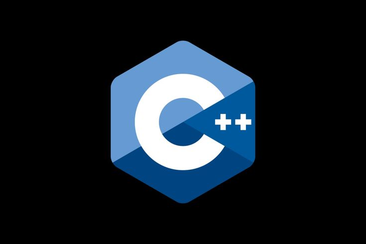
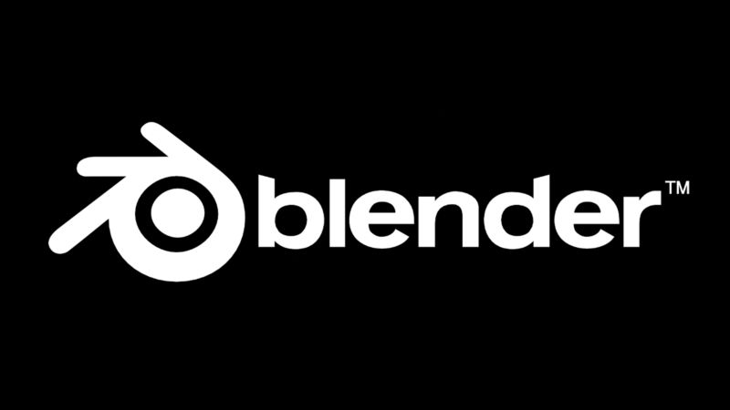
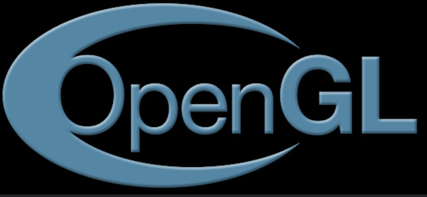

# 👋 Hi, I'm Abhineet Chakraborty!

  

  <h3>🌌 Vibe Coder | B.Tech CSE (Sem 1)</h3>
  
Building clean software, learning in the dark, and documenting the engineering journey.

  

    
    
    
  

---

### 🔮 The Stack & Focus
*   **Languages:** `Python` • `C++` • `OpenGL` *(Update these as you learn them)*
*   **Environment:** `VS Code` • `Windows` • `Git`
*   **Currently Obsessed With:** -Mastering Core Data Structures
                                 -clean system architectures
                                 -low level GPU programming.

---

### 📊 System Analytics

  
  
  

---

  
<i>"Turning caffeine into clean systems."</i>

  Let's build the future. Connect via my socials once they drop.

